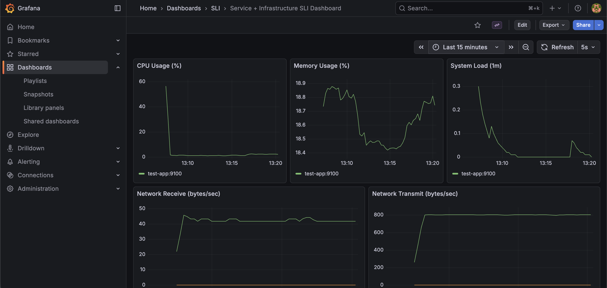
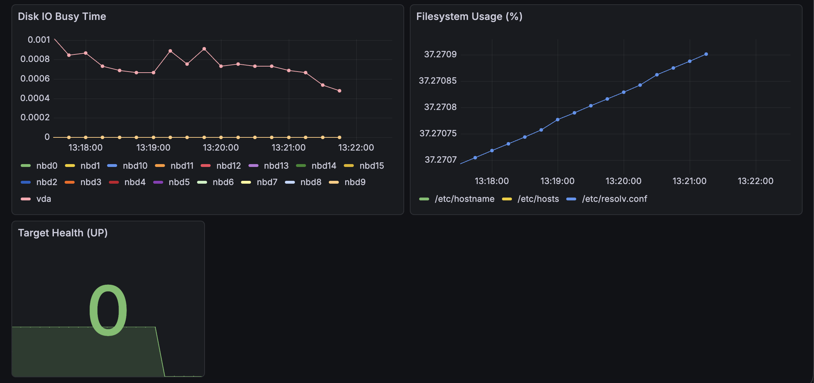
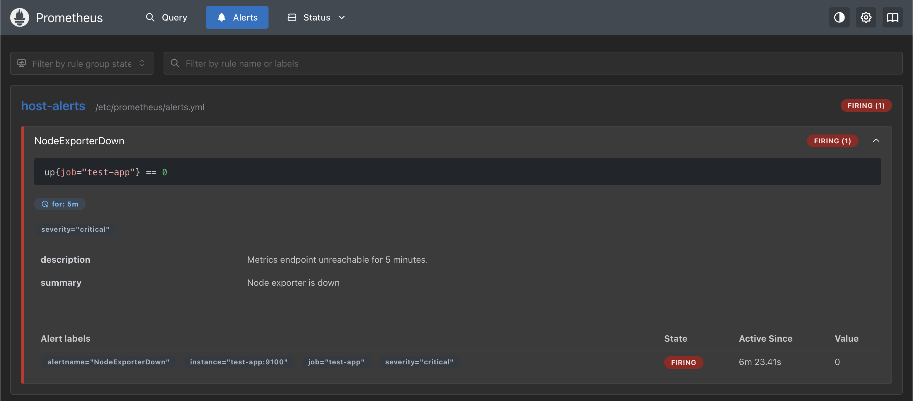

# Observability Stack — Grafana + Prometheus

A simple fully reproducible **observability platform** using **Docker Compose**, **Prometheus**, and **Grafana**, provisioned entirely as code. This section includes:

- Zero manual configuration
- Dashboards provisioned automatically
- Prometheus alerting rules as code
- Service + Infrastructure SLIs
- Noise-suppressed alerting
- Single-command startup

---

## Architecture Overview

```markdown
┌─────────────────────────────┐
│         Grafana             │
│  Dashboards + Alert UI      │
└──────────────┬──────────────┘
               │ Prometheus datasource
┌──────────────▼──────────────┐
│         Prometheus          │
│  Scraping + Alert Rules     │
└──────────────┬──────────────┘
               │ metrics scrape (demo/test app)
┌──────────────▼──────────────┐
│        Node Exporter        │
│     Host/System Metrics     │
└─────────────────────────────┘
```

---

## Grafana's Dashboard Sections

This stack provides:

### Application SLIs (RED Method)

| Metric      | Description                   |
| ----------- | ----------------------------- |
| P99 Latency | Request latency distribution  |
| Error Rate  | Percentage of failed requests |
| Throughput  | Requests per second           |

> These panels become active when applications expose Prometheus metrics.

### Additional Infrastructure SLIs (Useful to easily see metrics)

Metrics:

- CPU Usage
- Memory Usage
- Load Average
- Network Throughput
- Disk IO Busy Time
- Filesystem Usage
- Target Health

---

## Quick Start

### Requirements

- Docker
- Docker Compose plugin

---

### Start the Stack

```bash
docker compose up -d
```

or

```bash
make docker/up
```

This command automatically:

- Start Prometheus
- Start Grafana
- Create datasource
- Load dashboards
- Enable alert rules
- Start metric scraping

---

## Access Services

| Service    | URL                   |
| ---------- | --------------------- |
| Grafana    | http://localhost:3000 |
| Prometheus | http://localhost:9090 |

### Grafana Login

```
user: admin
password: admin
```

---

## Dashboard

Navigate to:

```markdown
SLI → Service + Infrastructure SLI Dashboard
```

Dashboards are **immutable** and recreated at container startup.

You will see:

<figure>
    
    <figcaption>Grafana SLI Dashboard.</figcaption>
</figure>

---

## Testing Alerts (Chaos Validation)

Simulate failure:

```bash
docker stop test-app
```

Expected behavior:

| Time        | Result        |
| ----------- | ------------- |
| immediately | scrape fails  |
| <5 minutes  | alert pending |
| ≥5 minutes  | alert firing  |

<figure>
    
    <figcaption>Scrape fails (No data).</figcaption>
</figure>

---

Check alerts:

```markdown
http://localhost:9090/alerts
```

After 5 minutes the alert will trigger:

<figure>
    
    <figcaption>Prometheus alerts.</figcaption>
</figure>

---

Restart exporter:

```bash
docker start test-app
```

Alert resolves automatically.

---

## Possible Next Steps

Recommended improvements:

- Add Alertmanager (Slack/PagerDuty)
- Persistent volumes
- Authentication
- Recording
