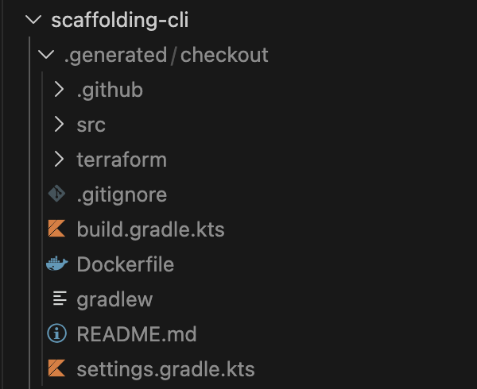

# Scaffolding CLI

Scaffold provides an tailor made CLI API of a tailor made microservices and applications scaffolding catalog.

## Project setup

Using a [virtual environment](https://click.palletsprojects.com/en/7.x/quickstart/#virtualenv) for development is recommended

``` bash
pip install virtualenv
virtualenv venv
. venv/bin/activate
pip install -e .
```

Once the execution of this commands is finished the environment is ready and the executable `scaffold` will be created.

### Local Execution

Since this project uses the python setuptools, once `pip install` is done you can just call `scaffold` in your shell.

If you're using the recommended virtual env, you must activate it first.

``` bash
. venv/bin/activate
scaffold {command}
```

For example:

``` bash
scaffold --help
Usage: scaffold [OPTIONS] COMMAND [ARGS]...

Options:
  --help  Show this message and exit.

Commands:
  microservice
```

## Microservice Commands

### Microservice help

```bash
scaffold microservice --help
Usage: scaffold microservice [OPTIONS] COMMAND [ARGS]...

Options:
  --name TEXT          The name of the new microservice. This will be the
                       project folder name.  [required]
  --type [api|worker]  The type of new microservice.  [required]
  --help               Show this message and exit.

Commands:
  create
```

### Create microservice

``` bash
scaffold microservice --name={ms-name} --type={ms-type} create
```

After executing you will see:

<figure>
    
    <figcaption>Generated demo ´Checkout´ application.</figcaption>
</figure>

---

> **Important!**
>> A better option for this implementation can be using GitHub template repositories instead generating locally the microservice code, this will allow more robust maintability for microservices repositories, versioning and more, but this option is not easily replicable using a mono-repository in a personal GitHub account.
